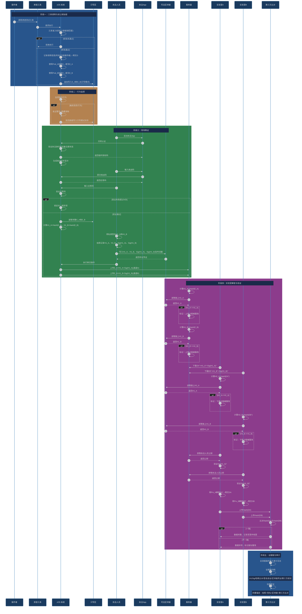
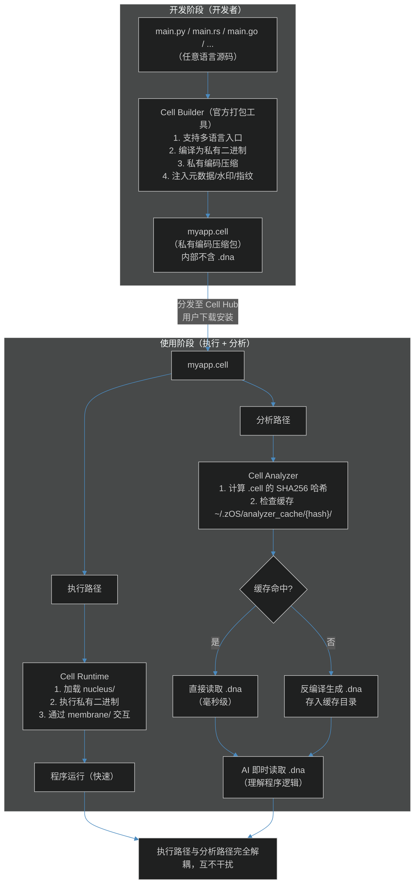

# zOS —— AI-Native Operating System

> **By zCore™ · 智核科技**
> *让操作系统真正理解你，而非仅执行你*

---

## 核心理念

传统 AI 软件通过 API 调用实现功能（如读屏），存在天然局限：

- 只能获取当前屏幕静态状态，无法自动翻页或模拟连续操作
- 模拟操作不真实，易触发风控机制
- AI 操作本质是"翻译"而非"执行"

**zOS 的方案**：将 AI 嵌入操作系统底层，使其操作即用户操作——直接模拟真实的鼠标、键盘、触控行为，实现自然、安全、抗检测的自动化交互。

---

## 系统架构总览

| 层级 | 说明 |
|------|------|
| **端侧（Primary）** | 核心能力本地运行，断网可用，保障隐私与响应速度 |
| **云端（Secondary）** | 辅助训练、复杂计算、靶场环境等增强服务 |

---

## 核心功能模块

### 1. 智能助理与任务执行

- 自然语言交互 + API 调用能力
- 示例：`"30分钟后提醒我接孩子"` → 理解 → 定时 → 弹窗提醒（含额外提示："出门前关灶台、带钥匙"）

### 2. 多用户管理与家长控制

- 管理员（admin/root）可通过自然语言配置策略
- 示例：`"今天只让孩子用1小时电脑，10:00后不准使用"` → 自动切换至孩子账户 → 计时 + 到点强制提醒/限制

### 3. 青少年安全上网

- 流量包内置智能过滤引擎，实现内容级绿色上网
- 区别于简单域名屏蔽，支持动态语义过滤

---

## 自进化机制 —— 越用越懂你

- 在基础 checkpoint 上**持续微调**，学习真实用户操作习惯
- 定期更新模型，使 AI 操作风格趋近于用户本人
- **典型场景**：滑动验证码时，AI 会学习用户的拖拽速度、末端减速、随机抖动等行为特征，实现拟人化操作

---

## 安全与网络攻防模块

> 本模块定位为**教学与防护**，严禁用于非法攻击。zOS 通过底层机制确保所有安全操作**全程可追溯、防篡改、不可抵赖**。

### 1. 工具准入控制（基于双公钥加密）

- **准入机制**：使用任何攻击/测试工具前，系统强制校验匹配的公钥或密钥文件，否则禁止运行。
- **底层加密**：当用户调用渗透测试工具时，系统不仅记录调用信息（时间/工具/操作者），还会在底层使用两套公钥（Pub_A 和 Pub_B）将明文数据分别加密为密文（E_A 和 E_B），并追加写入系统的**只写区**。

### 2. 攻击行为拦截与"只写模式"

- **行为拦截**：即使用户坚持执行攻击指令，系统将发出明确警告、全程隐藏录制操作。
- **只写模式落地**：拦截下的所有高危操作数据，采用**只写模式**记录。该模式下数据无密钥不可读、不可改，确保原始操作痕迹被绝对封存。

### 3. 现场取证与区块链存证（四重锚定）

当触发安全审计或需要提取证据时，zOS 将自动启动以下取证流程：

- **双重验证**：执法人员需通过"扫码身份认证 + 设备挑战码应答"双重验证，方可进入取证模式。
- **哈希锚定**：设备读取只写区中的密文（E_A/E_B）并计算哈希（H1_A/H1_B）。执法人员使用个人私钥对哈希进行数字签名（Sig(H1_A)/Sig(H1_B)）。
- **司法区块链存证**：签名后的哈希及时间戳将实时写入独立的**司法区块链**，获取不可篡改的存证凭证。
- **实验室验证闭环**：后续服务器和实验室分支在获取数据后，均需与区块链上的原始哈希进行比对，并验证数字签名。若哈希不一致，系统将精准定位是"上传过程"还是"下载过程"被篡改。

### 4. 取证流程总览

```mermaid
%%{init: {'theme': 'dark', 'themeVariables': {'primaryColor': '#1a3a5e', 'primaryTextColor': '#e0e0e0', 'primaryBorderColor': '#2d6a9f', 'lineColor': '#4a8abf', 'secondaryColor': '#16213e', 'secondaryTextColor': '#d0d0d0', 'tertiaryColor': '#0f3460', 'tertiaryTextColor': '#c8c8c8', 'noteBkgColor': '#1a2a4a', 'noteTextColor': '#e8e8e8', 'actorBkg': '#1a3a5e', 'actorBorder': '#2d6a9f', 'actorTextColor': '#e8e8e8', 'actorLineColor': '#4a8abf', 'messageTextColor': '#e0e0e0', 'messageLineColor': '#4a8abf', 'activationBkgColor': '#16213e', 'activationBorderColor': '#2d6a9f', 'sequenceNumberColor': '#6a8abf'}}}%%
flowchart TB
    subgraph Phase1["阶段一：工具调用与加密"]
        A1["1. 用户调用渗透测试工具"] --> A2["2. 工具准入校验：公钥/密钥匹配？"]
        A2 -- 未通过 --> A3["拒绝执行"]
        A2 -- 通过 --> A4["3. 记录调用信息(时间/工具/操作者)→明文D"]
        A4 --> A5["4. 使用Pub_A加密D→密文E_A"]
        A5 --> A6["5. 使用Pub_B加密D→密文E_B"]
        A6 --> A7["6. E_A和E_B追加写入只写区"]
    end

    subgraph Phase2["阶段二：行为监控"]
        A7 --> B1{"7. 是否触发高危行为？"}
        B1 -- 否 --> B2["8. 正常执行，数据持续累积"]
        B2 --> B1
        B1 -- 是 --> B3["9. 行为拦截：发出警告+隐藏录制"]
        B3 --> B4["10. 高危数据写入只写模式封存"]
    end

    subgraph Phase3["阶段三：现场取证"]
        B4 --> C1["11. 执法人员启动取证模式"]
        C1 --> C2["12. 第一次验证：执法App扫码"]
        C2 --> C3["13. 后台验证执法身份和设备注册状态"]
        C3 --> C4["14. 验证通过，返回临时授权码"]
        C4 --> C5["15. 第二次验证：设备生成挑战码"]
        C5 --> C6["16. 执法人员输入挑战码获取应答码"]
        C6 --> C7["17. 设备验证应答码(超N次失败→锁定上报)"]
        C7 --> C8["18. 设备读取完整E_A和E_B"]
        C8 --> C9["19. 计算H1_A=Hash(E_A)，H1_B=Hash(E_B)并显示"]
        C9 --> C10["20. 执法人员用私钥签名H1_A和H1_B"]
        C10 --> C11["21. 拍照记录H1_A、H1_B、Sig(H1_A)、Sig(H1_B)"]
        C11 --> C12["22. 写入司法区块链，获取存证凭证"]
        C12 --> C13["23. 执行移交操作"]
        C13 --> C14["24. 上传E_A+H1_A+Sig(H1_A)(通道A)，上传E_B+H1_B+Sig(H1_B)(通道B)"]
    end

    subgraph Phase4["阶段四：实验室解密与验证"]
        C14 --> D1["25. 服务器计算H1_A'=Hash(E_A)，与区块链H1_A比对"]
        D1 --> D2{"一致？"}
        D2 -- 否 --> D3["标记：上传过程被篡改"]
        D2 -- 是 --> D4["26. 计算H1_B'=Hash(E_B)，与区块链H1_B比对"]
        D4 --> D5{"一致？"}
        D5 -- 否 --> D6["标记：上传过程被篡改"]
        D5 -- 是 --> D7["27. 实验室分支A/B下载数据"]
        D7 --> D8["28. 分支计算H2=Hash(下载数据)，与区块链H1比对"]
        D8 --> D9{"一致？"}
        D9 -- 否 --> D10["标记：下载过程被篡改"]
        D9 -- 是 --> D11["29. 从司法后台获取执法人员公钥，验证签名"]
        D11 --> D12["30. 分支A用Prv_A解密EA→明文DA，分支B用Prv_B解密EB→明文DB"]
        D12 --> D13["31. 分支A计算Hash(DA)，分支B计算Hash(DB)，上传第三方比对系统"]
        D13 --> D14["32. 第三方比对Hash(DA)与Hash(DB)"]
        D14 --> D15{"一致？"}
        D15 -- 一致 --> D16["33. 数据完整，记录至案件档案"]
        D15 -- 不一致 --> D17["34. 数据异常，标记疑似篡改，启动调查"]
    end

    subgraph Phase5["阶段五：证据链与审计"]
        D16 --> E1["35. 全流程操作写入审计日志"]
        D17 --> E1
        E1 --> E2["36. 证据链归档：H1/Sig/哈希比对/签名验证/区块链凭证/第三方结论"]
        E2 --> E3["37. 法庭呈证：四重锚定(拍照+签名+区块链+第三方比对)"]
    end
```



### 5. 加密与存证时序



---

## 训练范式革新

**问题现状：** 纯视频训练存在严重安全隐患——模型识别录屏中的鼠标图标和控件，而非真实操作信号，可能忽略哈希校验，盲目模仿视频中的操作，导致误执行危险指令。

**zOS 方案：**

| 策略 | 说明 |
|------|------|
| **信号来源** | 直接从系统底层获取真实鼠标/点击信号，而非 CV 识别 |
| **CV 角色** | 仅用于总结屏幕内容（如"视频正在播放"），记录位置+哈希（哈希优先） |
| **记忆控制** | 屏幕信息不写入操作记忆，除非用户明确指令："学习视频中的操作并示范" |
| **隐私保护** | 引入**无痕模式**，解决现阶段"真遗忘"技术难题 |

---

## .cell —— 新一代可执行程序格式

> `.cell` 是 zOS 的原生可执行程序格式，它不只是一个文件后缀，而是一套完整的"程序即生命体"哲学体系。

**为什么是 .cell？**

- 程序像细胞一样，是**最小功能单元**
- 每个程序有自己的**边界**（细胞膜）、**核心**（细胞核）、**功能器**（细胞器）
- 细胞会**代谢**（更新）、**分裂**（fork/派生）、**凋亡**（优雅退出）
- AI 时代，程序应当是有"生命"的，而非静态的二进制尸体

**.cell 的本质：** 一个**经过私有编码的压缩包**，采用私有编码协议（非公开压缩算法 + 自定义元数据结构），内部结构固定、可被官方工具识别，普通解压软件无法正确解析，防止随意篡改。

**.cell 的文件结构：**

```
myapp.cell/                    ← 私有压缩格式，普通工具不可解析
├── manifest.json              # 元数据、权限声明、入口点
├── nucleus/                   # 细胞核 —— 不可反编译的安全核心
│   └── core.bin               # 私有二进制，Cell Runtime 直接执行
├── membrane/                  # 细胞膜 —— 对外接口声明
│   ├── api.json               # 导出接口定义
│   └── events.json            # 可监听/触发的生命周期事件
├── resources/                 # 资源文件
│   ├── icons/
│   └── locales/
└── cell.manifest              # 遗传信息：版本链、依赖关系、更新源
```

> **注意**：`.cell` 内部**不包含 `.dna`**。`.dna` 由 `Cell Analyzer` 在分析时动态生成并缓存，确保：
>
> - `.dna` 明确是"分析产物"，不是"开发语言"
> - 开发者无法绕过源码直接编写/修改 `.dna` 运行
> - `.cell` 体积最小化，仅包含执行所需内容

---

## .dna —— 官方中间语言（分析层）

> `.dna` 是 zOS 官方推出的中间语言，由 `Cell Analyzer` 在分析时动态生成。

**定位：**

- **用途**：供 AI 和人类理解程序逻辑，进行安全审计和行为分析
- **特性**：可读、有损、不可逆回源码
- **存储**：不存储在 `.cell` 中，由 Analyzer 生成后缓存于本地
- **不可运行**：仅为逻辑描述层，不包含可执行实现

**为什么不在 .cell 中存储 .dna？**

| 考量 | 说明 |
|------|------|
| **明确边界** | `.dna` 是分析产物，不是开发语言，不与执行路径混合 |
| **防止滥用** | 避免开发者绕过源码直接编写/修改 `.dna` 运行 |
| **保持纯粹** | `.cell` 仅包含可执行内容，`.dna` 仅用于分析理解 |
| **体积优化** | `.cell` 不存储额外信息，保持最小体积 |
| **职责分离** | 执行路径与分析路径完全解耦 |

**生成与缓存机制：**

| 策略 | 说明 |
|------|------|
| **首次分析** | Analyzer 反编译生成 `.dna`，存入本地缓存 |
| **后续分析** | 检测缓存命中，即时读取 `.dna`，无延迟 |
| **缓存失效** | 检测 `.cell` 哈希/版本变化，自动重新生成 |
| **缓存位置** | `~/.zOS/analyzer_cache/{cell_hash}/` |
| **用户控制** | 支持清空缓存、导出 `.dna`、手动刷新 |

**DNA 规范与示例：**

以下为 `.dna` 中间语言的完整规范定义，其中 `// ←` 注释为字段说明，`// 示例值` 为对应示例。

```
// ============================================================
// .dna 中间语言规范 v1.0（含示例）
// 编译自：main.py (原始源码已不可逆)
// 分析生成时间：2026-08-25T10:30:00Z
// 编译指纹：zCORE-9F3A-2B7D
// ============================================================

#!dna                          // 文件头标识，标识本文件为 .dna 格式
version: "1.0"                 // 规范版本号
module: "user_auth"            // ← 模块名称（示例：用户认证模块）
fingerprint: "zCORE-9F3A-2B7D" // ← 编译指纹，用于溯源
generated_at: "2026-08-25T10:30:00Z" // ← 分析生成时间（ISO 8601）
source_hash: "a3f9c2e1..."     // ← 源 .cell 的 SHA256 哈希
compiled_from: "main.py"       // ← 原始源码文件名

module "user_auth" {            // ← module 块：定义一个功能模块
    version: "3.2.1"            //   version: 语义化版本号（x.y.z）
    description: "用户认证模块"  //   description: 模块功能描述

    // --- 接口定义 ---
    interface authenticate(cred: Credential) -> AuthResult {
        description: "验证用户凭证，返回认证结果"  // 接口功能说明
    }

    interface logout(session: Session) -> Status {
        description: "销毁会话，清理缓存"
    }

    // --- 数据流定义 ---
    data_flow authenticate {
        input: Credential {     //   input: 输入参数类型及字段
            uid: string,        //     field1: type
            secret: string      //     field2: type
        }
        step1: validate_format(cred)     //   step1: 第一步操作
        step2: lookup(cred.uid) -> identity // step2: 第二步操作（返回 identity）
        step3: compare(cred.secret, identity.secret) -> match
        output: AuthResult {    //   output: 返回值类型及字段
            success: match,     //     field: value
            user: identity
        }
    }

    // --- 依赖声明 ---
    depends_on {
        service: "lookup_service",  //   service: 依赖的服务名
        service: "compare_service"  //   可声明多个依赖
    }

    // --- 安全标记 ---
    security {
        level: "high"              //   level: 安全等级 (low | medium | high)
        requires: "user_consent"   //   requires: 所需权限/许可
        audit_log: true            //   audit_log: 是否记录审计日志 (true | false)
    }
}
```

---

## 完整工具链闭环



---

## AI 协同机制

**两条路径，各司其职：**

| 路径 | 负责模块 | 数据源 | 目的 |
|------|---------|--------|------|
| **执行路径** | Cell Runtime | `nucleus/*.bin` | 运行程序 |
| **分析路径** | Cell Analyzer + AI | 缓存 `.dna` | 理解逻辑 |

**AI 如何工作：**

| 阶段 | AI 行为 | 数据来源 | 说明 |
|------|---------|---------|------|
| **理解程序** | 读取 `.dna`，理解接口和数据流 | 缓存 `.dna` | 即时读取，无需等待反编译 |
| **执行任务** | 通过 `membrane/` 接口调用 | `membrane/api.json` | 直接调用，不经过 `.dna` |
| **安全审计** | 分析 `.dna` 中的依赖和安全标记 | 缓存 `.dna` | 检测高危操作 |
| **学习进化** | 学习程序行为模式 | `.dna` + 执行轨迹 | 持续优化 |
| **禁止行为** | 从 `.dna` 还原/补全原始源码 | — | 硬性阻断（信息已丢失） |

---

## 知识产权保护矩阵

| 策略层级 | 措施 | 说明 |
|---------|------|------|
| **格式层** | 私有编码压缩 | `.cell` 使用非公开协议，普通工具无法解包 |
| **编译层** | 私有二进制 | `nucleus/` 中的二进制采用私有格式，不可反编译 |
| **分析层** | 有损转换 | `.dna` 是分析产物，信息量低于源码，天然不可逆 |
| **存储层** | 缓存隔离 | `.dna` 存储在本地缓存，不随 `.cell` 分发 |
| **工具层** | 单向工具链 | `Builder` 和 `Analyzer` 功能不对称 |
| **AI层** | 双模型隔离 | 代码生成 AI 与 DNA 解析 AI 独立运行 |
| **升级层** | 官方独占 | `Analyzer` 仅由官方维护升级 |
| **溯源层** | 水印/指纹 | 每个 `.cell` 植入开发者水印 + 编译指纹 |
| **法律层** | 许可约束 | 官方许可明确禁止 `.dna → 源码` 的逆向工程 |

---

## 配套工具链

| 工具 | 名称 | 说明 | 开放程度 |
|------|------|------|---------|
| 打包器 | **Cell Builder** | 多语言源码 → `.cell`（私有压缩） | 官方+第三方适配 |
| 运行时 | **Cell Runtime** | zOS 内置，执行 `nucleus/` 私有二进制 | 闭源，系统集成 |
| 分析器 | **Cell Analyzer** | `.cell` → 缓存 `.dna`，供 AI 分析 | 官方独占 |
| 应用市场 | **Cell Hub** | `.cell` 分发与版本管理 | 开放 |
| 开发套件 | **Cell SDK** | 各语言绑定、API 库、调试工具 | 开源 |
| 语言规范 | **DNA Specification** | `.dna` 中间语言完整规范 | 公开文档 |

---

## 核心理念

> **程序不应是冷冰冰的二进制尸体，而是有生命、有边界、可进化的细胞。**
> **执行走 `nucleus/`，分析看 `.dna` —— 两条路径，各司其职。**
> **zOS + .cell + .dna = 操作系统与程序共同进化。**

---

## 许可证与声明

> zOS 坚持**技术向善**原则，所有安全攻防功能仅限教育与防护用途。
> 任何滥用行为与项目方无关，且系统内置全程审计与拦截机制。

**zCore™ · 智核科技**

*让操作系统真正理解你*
